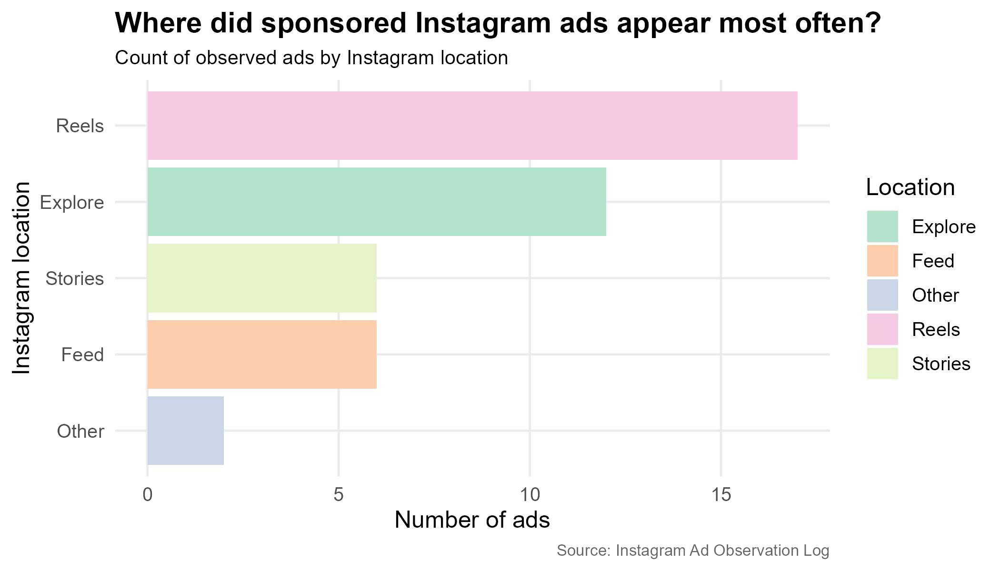
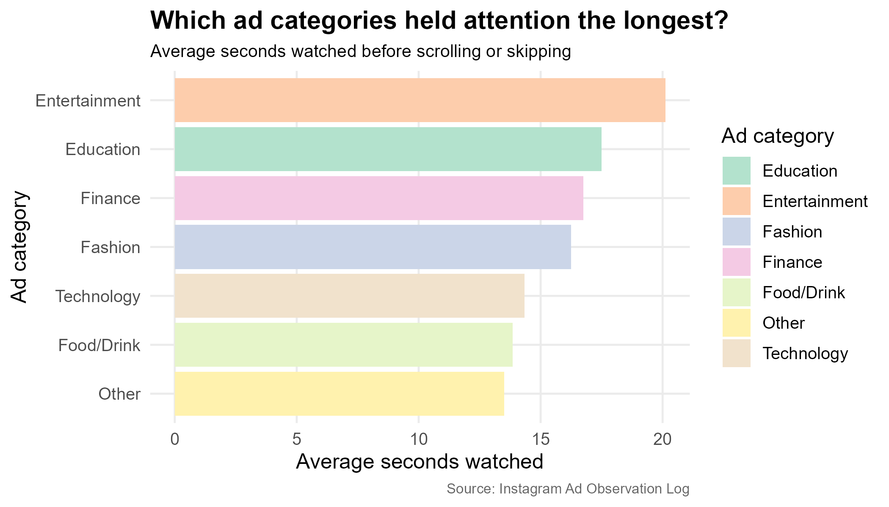
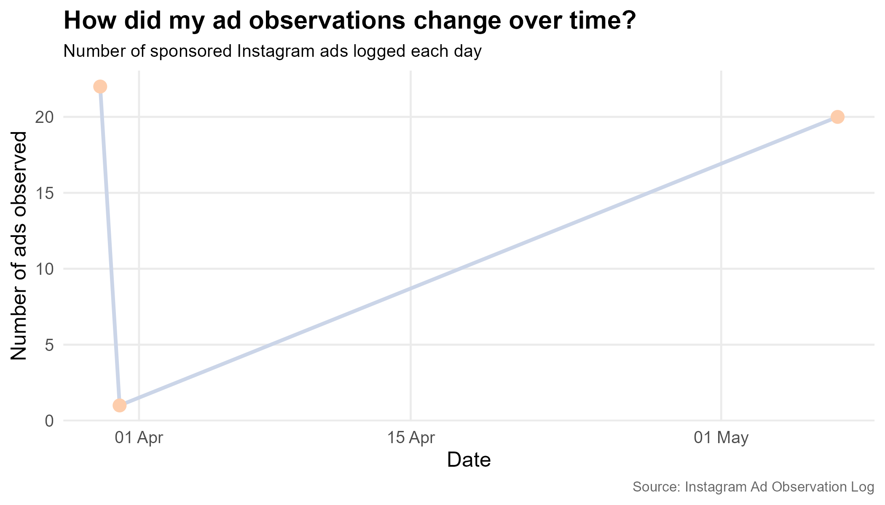

<script src="https://code.jquery.com/jquery-3.7.1.min.js" integrity="sha256-/JqT3SQfawRcv/BIHPThkBvs0OEvtFFmqPF/lYI/Cxo=" crossorigin="anonymous"></script>

```{r setup, include=FALSE}
knitr::opts_chunk$set(echo=FALSE, message=FALSE, warning=FALSE, error=FALSE)
```

```{js}
$(function() {
  // Start all sections invisible (opacity 0, shifted down slightly)
  $(".level2").addClass("section-hidden");
  $(".container-fluid").height($(".container-fluid").height() + 300);

  function checkSections() {
    $(".level2").each(function() {
      var top = $(this).offset().top - $(window).scrollTop();
      var windowHeight = $(window).height();
      if (top < windowHeight * 0.88) {
        $(this).removeClass("section-hidden").addClass("section-visible");
      } else {
        $(this).removeClass("section-visible").addClass("section-hidden");
      }
    });
  }

  // Run once on load so the first section is already visible
  checkSections();
  $(window).on('scroll', checkSections);
})
```

```{css, echo=FALSE}
.figcaption { display: none; }

/* ── Base ── */
body {
  background-color: #f5f4f0;
  color: #1a1a1a;
  font-family: -apple-system, BlinkMacSystemFont, "Segoe UI", Helvetica, Arial, sans-serif;
  font-size: 16px;
  line-height: 1.75;
}

.container-fluid {
  max-width: 860px;
  margin: auto;
  padding: 2.5rem 1.5rem 4rem;
}

/* ── Hero header ── */
.hero-block {
  background: #ffffff;
  border-radius: 16px;
  border: 1px solid #e8e6e0;
  padding: 3rem 2.5rem;
  text-align: center;
  margin-bottom: 2rem;
}

h1.title {
  font-size: 2rem;
  font-weight: 700;
  letter-spacing: -0.02em;
  color: #1a1a1a;
  margin-bottom: 1rem;
  border: none;
  padding: 0;
}

.hero-intro {
  font-size: 1rem;
  color: #6b6860;
  max-width: 580px;
  margin: 0 auto 1.75rem;
}

/* ── Stat chips ── */
.stats-row {
  display: flex;
  justify-content: center;
  gap: 12px;
  flex-wrap: wrap;
  margin-top: 1.5rem;
}

.stat-chip {
  background: #f5f4f0;
  border-radius: 10px;
  padding: 0.6rem 1.25rem;
  text-align: center;
  min-width: 120px;
}

.stat-chip .val {
  font-size: 1.4rem;
  font-weight: 700;
  color: #1a1a1a;
  line-height: 1.2;
}

.stat-chip .lbl {
  font-size: 0.75rem;
  color: #8a8880;
  margin-top: 3px;
}

/* ── Note pill ── */
.note {
  display: flex;
  align-items: flex-start;
  gap: 10px;
  background: #ffffff;
  border-left: 3px solid #5DCAA5;
  border-radius: 0 10px 10px 0;
  padding: 14px 18px;
  margin: 0 0 2rem;
  font-size: 0.875rem;
  color: #5a5855;
  line-height: 1.65;
}

/* ── Section cards ── */
.section.level2 {
  background: #ffffff;
  border-radius: 16px;
  border: 1px solid #e8e6e0;
  padding: 2rem 2.25rem 2.25rem;
  margin-bottom: 1.5rem;
  box-shadow: none;
  transition: opacity 0.6s ease, transform 0.6s ease;
}

.section-hidden {
  opacity: 0;
  transform: translateY(28px);
}

.section-visible {
  opacity: 1;
  transform: translateY(0);
}

h2 {
  display: flex;
  align-items: center;
  gap: 14px;
  font-size: 1.15rem;
  font-weight: 700;
  color: #1a1a1a;
  background: none;
  padding: 0;
  border-radius: 0;
  margin-top: 0;
  margin-bottom: 1.25rem;
  border-bottom: 1px solid #f0ede8;
  padding-bottom: 1rem;
}

h2::before {
  content: attr(data-num);
  display: inline-flex;
  align-items: center;
  justify-content: center;
  width: 28px;
  height: 28px;
  border-radius: 50%;
  font-size: 0.8rem;
  font-weight: 700;
  flex-shrink: 0;
  background: #E1F5EE;
  color: #0F6E56;
}

/* Override per-section number colours */
.level2:nth-of-type(2) h2::before { background: #E1F5EE; color: #0F6E56; }
.level2:nth-of-type(3) h2::before { background: #EEEDFE; color: #3C3489; }
.level2:nth-of-type(4) h2::before { background: #FAEEDA; color: #633806; }
.level2:nth-of-type(5) h2::before { background: #FAECE7; color: #712B13; }

p {
  font-size: 0.9625rem;
  color: #4a4845;
  max-width: 780px;
  margin-left: 0;
  margin-right: 0;
}

strong {
  font-weight: 700;
  color: #1a1a1a;
}

img {
  display: block;
  margin: 1.5rem auto;
  max-width: 100%;
  border-radius: 12px;
  border: 1px solid #e8e6e0;
}

/* ── Conclusion ── */
.conclusion {
  background: #f5f4f0;
  border-radius: 14px;
  padding: 1.75rem 2rem;
  margin-top: 0.5rem;
}

.conclusion p {
  font-size: 0.9rem;
  color: #5a5855;
}
```

<div class="hero-block">
<h1 class="title">How Instagram Ads Compete for Attention</h1>
<p class="hero-intro">An observational log of sponsored Instagram ads — exploring where they appear, what categories hold attention longest, and how personalisation shapes relevance.</p>
<div class="stats-row">
<div class="stat-chip"><div class="val">43</div><div class="lbl">Ads observed</div></div>
<div class="stat-chip"><div class="val">16.2s</div><div class="lbl">Avg watch time</div></div>
<div class="stat-chip"><div class="val">3.6 / 5</div><div class="lbl">Avg relevance</div></div>
</div>
</div>

<div class="note">
<strong>Visual theme:</strong> The 7-class Pastel2 qualitative palette from ColorBrewer is used throughout, chosen because Instagram location and ad category are separate groups rather than ordered values.
</div>

## Reels was the main place ads appeared



Sponsored ads were not spread evenly across Instagram locations. **Reels had the highest number of observed ads**, followed by **Explore**. Feed and Stories appeared less often in my observations.

Reels and Explore are both areas where users often scroll through new content, so it makes sense that many sponsored ads appeared there during the observation period.

## Entertainment ads held attention the longest



The second plot compares average seconds watched per ad category. **Entertainment ads had the highest average watch time**, at about **20 seconds**. Education, Finance, and Fashion ads also had relatively high viewing times.

This part of the story is about attention rather than frequency. An ad category may not appear most often, but can still be effective if it makes people pause longer.

## Relevance seemed connected to longer watch time


Higher relevance ratings often lined up with longer viewing times. Ads rated **1 or 2** tended to have low watch times, while ads rated **4 or 5** included many observations with longer watch times.

Ads that seemed related to recent activity were more common among the higher relevance ratings — supporting the idea that Instagram ads feel more personal when they connect to recent searches, viewing, or purchases.

## The observations happened in bursts



Data collection happened in bursts rather than evenly every day — with a spike around 30 March, a near-zero count on 31 March, and another peak in early May.

This is useful context: the types of ads seen on one heavy scrolling day may not perfectly represent every day of Instagram use.

## Overall, the ads looked moderately personalised

<div class="conclusion">

Across the four visualisations, Instagram ads were most commonly observed in Reels and Explore, entertainment ads held attention for the longest time, and higher relevance ratings were generally associated with longer watch times.

The data also suggests moderate personalisation: many ads seemed connected to recent online activity, and those ads often had higher relevance ratings. However, because this is an observational log from a limited period, the results should be interpreted as patterns from my collected observations rather than proof of exactly how Instagram's algorithm works for everyone.

</div>
